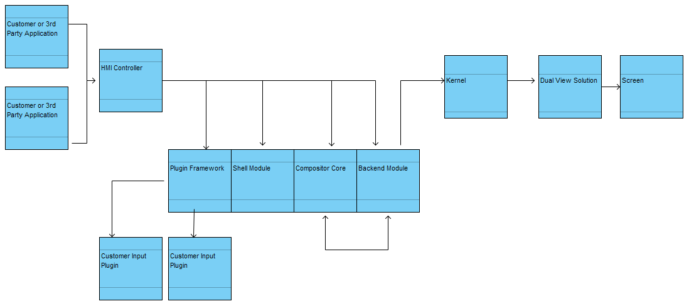
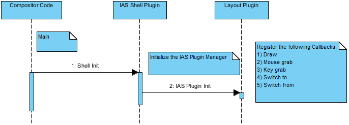
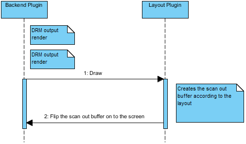
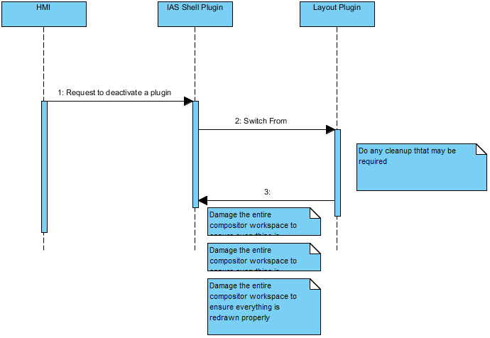

# Details {#details}

[TOC]

@subpage fastboot

@subpage overview

@subpage softwareoverview

@subpage flows

#################################################################################
#################################################################################

@page fastboot Fastboot

# GRAPHICS Fastboot vs. Rendering Performance

There are two options available in the graphics stack for 3D rendering DRI driver. They are 
the i965 driver and the UFO driver. DRI driver is loaded by EGL which is bound on a per 
process basis. This means that an application can bind to either of these drivers depending 
upon its function and what it deems as more important - rendering performance or faster 
loading. The actual selection of the driver is done via an environment variable.  

Due to a substantial difference in the rendering capability of the two drivers in the favor of 
UFO DRI, \IASPrgName would default all applications after bootup to run with it only. UFO 
driver will be kept in the default location and no environment variable is necessary while 
launching an application. 

However, UFO DRI is more than double the size of the i965 DRI, compounded with the fact 
that there is a direct relationship in between fast boot and small binary size of components.
As such, \IASPrgName would use i965 DRI for fast boot applications. This normally entails 
only two applications:  

<ol>
<li>Weston compositor</li>
<li>Early video application</li>
</ol>

Due to the rendering performance issue highlighted above, early video may be stopped 
after fast boot has been accomplished and restarted with UFO DRI if necessary at a later 
point. However, Weston compositor once started cannot be stopped or else the user would 
experience a blank screen while it restarts. This implies that any 3D compositing that it 
does may not get optimum GPU performance. While, small shaders that come with 
upstream Weston compositor will hardly see a performance difference in between the two 
DRIs, larger custom shaders written by a customers own compositor may experience 
slower performance while using the i965 DRI. This needs to be a consideration while 
writing the shaders and the 3D compositing code for the compositor. For the \IASPrgName 
IAS compositor, after doing extensive testing, it has been determined that there is an 
indistinguishable difference in the rendering performance between the two DRIs.

#################################################################################
#################################################################################
 
@page overview Overview
 
# GRAPHICS Architecture Overview
 
There are two options available in the graphics stack for 3D rendering DRI driver. They are
the i965 driver and the UFO driver. DRI driver is loaded by EGL which is bound on a per
process basis. This means that an application can bind to either of these drivers depending
upon its function and what it deems as more important - rendering performance or faster
loading. The actual selection of the driver is done via an environment variable.  
 
The scope of operation for Graphics subsystem of \IASPrgName is as follows: 

<ol>
<li>Display - Ability to query and set a mode on a screen.</li>
<li>Render - Ability to draw 2D and 3D content using OGLES and OGL APIs.</li>
<li>Video - Ability to decode a video file and display the raw frames on the screen.</li>
<li>Wayland compositor - Provide a compositor that effectively uses the above 3 areas. </li>
</ol>
 

The Graphics subsystem assumes that it is executed on Broxton SOC. 
 
#################################################################################
#################################################################################
 
@page softwareoverview SoftwareOverview
 
# GRAPHICS Software Overview {#IasGraphicsSoftware}
 
[TOC]

This provides an overview of the Graphics system.

## General Overview {#IasGraphicsGeneralOverview}

The mission of the Graphics Subsystem is to provide high-quality visual feedback in a 
multi-display automotive environment. 

The Graphic Subsystem delivers the capabilities to meet the automotive requirements for 
visual feedback in the vehicle interior. This means providing in-time visualization to driver, 
passenger & rear seat entertainment from sources like internet, 3rd party applications & 
devices, navigation & DVD/Blue ray players where source and sink can be front units and 
rear seat units in any configuration. 

A challenge is providing a suitable data transfer rate if passengers use more than one data 
source. 

There are natural cross dependencies between the Graphic Subsystem, the system as a 
whole and provided hardware / drivers: Due to the fact, that some graphic calculations & 
driver calls are done on the CPU, the final graphic performance is both, limited by the 
chosen hardware & limited by current CPU and GPU load of the running system.
In general increasing screen sizes, dual view screens and extensions to head-up displays 
and in-cluster displays sharing GPU among several applications with different output to 
parts of displays (split screen) or multiple displays will increase requirements regarding 
computational power and possibility to share it. 

For future versions of \IASPrgShortName: As the GPU can also be used to perform data processing there 
will most likely be an impact by future ADAS systems. The latter will also bring 
requirements regarding image rendering.

## Compositor {#IasGraphicsCompositorOverview}

Traditionally, a compositor has had two major responsibilities: Composition of multiple 
windows and Window Decoration. However, each \IASPrgShortName customer would want decoration, 
layouts and transitional effects to be their differentiator from other customers. As such, \IASPrgShortName
compositor cannot encompass all possible layouts and effects for each customer. 
Therefore, the compositor is designed to allow customization by supporting a plug-in 
architecture. In this plugin model, certain core responsibilities like the creation/deletion of 
surfaces or sending the final scan out buffer to the HW would be the compositor core 
module's responsibility (which it will be able to accomplish using it's backend plugin). 
However, \IASPrgShortName compositor would also release the responsibilities of drawing the various 
layouts (Carousel, NxM grid, Cube etc.) to the layout plugin and input handling to the input 
plugin. These plugins would be the responsibility of the customer or their Tier 1. 

A compositor's main responsibility is to composite application windows. When designing 
products with \IASPrgName, the designer will have unique ideas as to how the 
Human Machine Interface (HMI) should look and feel. For that reason, Intel, as part of 
the \IASPrgName project, has designed its compositor to incorporate a plug-in 
architecture. 
 
The plug-in architecture allows overriding the standard behavior of core compositor 
functionality such as window positioning,screen rendering, and input handling. The 
flexibility exposed by the plug-in interface allows development of custom user 
interfaces with a unique look and feel via the use of 3D rendering effects, animated 
application transitions, or custom input handling logic. The key focus of these plugins is 
to customize the look and feel according tothe designer's needs and specifications. 

The list of plugins that should be loaded and initialized is specified by the 
configuration file,  activation of a loaded plugin is done via a 
specific request in the Wayland protocol defined by IAS. It's up to the customized HMI 
software to determine when an appropriate time to actually send that request is. A 
layout plugin generally implements a draw function that allows compositing via GLES 
rendering calls. As an alternative, a layout plugin may elect to not perform any 
rendering at all, but instead may select a client-rendered buffer that should be flipped 
to the screen directly (if it meets various criteria). Layout plugins are useful for both 
long-term layout rendering and for short-term animation effects. 

An input plugin is needed in multi-output setups where different layout plugins can be 
active on different outputs. In this situation, the compositor needs a way to determine 
which layout plugin needs to be informedabout various input events that can be 
received. For example, if two layout plugins are registered for cursor events and the 
cursor is moved, the input plugin would be responsible for deciding which layout plugin 
is notified about the event. The input plugin resolves this conflict by taking the cursor 
input event from the compositor, working out which output it belongs to and then which 
layout plugin is acting upon that output. The cursor input event is then forwarded to 
that layout plugin. If there is no layout plugin present, the event will be processed by 
the compositor's built-in input handler. The same holds true for touch events and 
keyboard events.  

An input plugin also acts as a central location to intercept events and perform any 
special handling that may be needed on these events. For example, one can create 
some special effect every time a cursor is moved. An input plugin is optional. If an 
input plugin is not present, the default compositor input handling is used.

## Plugin Model {#IasGraphicsPluginOverview}

The following are the salient points regarding the plugin model:  

<ul>
<li>Customer provides a plugin that is dynamically linked with the \IASPrgShortName compositor.</li>
<li>Customer gets access to textures as well as other data structures that they need inside the compositor. They can draw special effects.</li>
<li>Intel provides a fully tested \IASPrgShortName compositor. </li>
<li>Customer tests their plugin integrated with compositor.</li>
<li>Separation of responsibilities. </li>
<li>Customer can change their plugin to their liking without being dependent on Intel.</li>
<li>Flexible and scalable architecture.</li>
</ul>

There are four high-level components:

<ol>
<li>Core compositor</li>
<li>ias-shell</li>
<li>ias-backend</li>
<li>ias-plug-in framework.</li>
</ol>

The plug-in framework component specifies layout and input plugins via the IAS 
configuration file. An ias_layout_manager interface is exposed to clients to allow 
them to activate/deactivate layout plugins and respond to layout changes. 

### Core Compositor

Weston is the core compositor. This compositor implements the core Wayland 
protocols

### ias-shell

The ias-shellhas been designed to provide a client protocol tailored to automotive 
IVI system needs. It is not compatible withthe Weston desktop or tablet shells and 
consequently does not support clients that depend on desktop or tablet specific 
features.  

For details on the protocol, see the ias-shell.xml file.

### ias-backend

The Intel Automotive Solutions Compositor backend module is what enables the use of 
layout plugins and provides the interface to the Intel Embedded Media and Graphics 
Driver (Intel EMGD) kernel mode driver. It takes advantage of specific capabilities of 
the Intel EMGD driver. The backend module will also work with the standard i915 
kernel mode driver, but the following capabilities will not function:

<ul>
<li>frame buffer gamma correction</li>
<li>frame buffer contrast adjustment</li>
<li>frame buffer brightness adjustment</li>
</ul>

For details ias-backend.xml file.

### ias-plugin-framework

One of the unique features of the IAS compositor is the ability to invoke custom layout 
plugins. When a layout plugin is loaded and enabled, it intercepts the basic Weston 
compositor draw()function and replaces it with whatever custom routines are 
provided by the plugin. This ability allows control over how application surfaces are 
presented on the screen. Example layout plugins are provided; see below for more 
details. 

To use the IAS plug-in framework, add the ias-plugin-frameworkmodule to the 
weston.ini configuration file.  

For example:  

    [core]
    modules=ias-shell.so,ias-plugin-framework.so

Custom plugins are specified in the ias.conf configuration file.  

For example:

    <plugin name='grid' lib='path_to_grid_plugin.so' />
    <plugin name='list' lib='path_to_list_plugin.so' />
    <input_plugin name='touch' lib='path_to_touch_plugin.so' />

The IAS plug-in framework may be used with any shell module. Some IVI-specific 
helper functions will return meaningful results only when using the IAS shell.

In the above sequence chart, one can see how the Graphics Architecture is configured.
 

#################################################################################
#################################################################################

@page flows KP Compositor Plugin Flows

# GRAPHICS Compositor Flow Information {#IasGRAPHICS_Flows}

[TOC]

## GRAPHICS KP Compositor Plugin Initialization {#IasGRAPHICS_flowinit}
 

In the above sequence chart, one can see how the Graphics Architecture is Initialized.
 
## GRAPHICS KP Compositor Render {#IasGRAPHICS_flowrender}
 

In the above sequence chart, one can see how a graphics render is performed.
 
## GRAPHICS KP Compositor Activates a Plugin  {#IasGRAPHICS_flowactivate}
 

In the above sequence chart, one can see how to activate a plugin.
 
## GRAPHICS KP Compositor Deactivates a Plugin  {#IasGRAPHICS_flowdeactivate}
 

In the above sequence chart, one can see how to deactivate a plugin.
 
## GRAPHICS KP Compositor Deactivates a Plugin from a Plugin {#IasGRAPHICS_flowdeactivatefromplugin}
 

In the above sequence chart, one can see how to deactivate a plugin from a plugin.
 
#################################################################################
#################################################################################

@page external External Interface

# GRAPHICS Data Structure Information {#IasGRAPHICS_Data}

[TOC]

The following events and requests describe the external interface to the software. 

The description is composed of 

<table style="border:1px solid black;border-collapse:collapse;" width="100%" cellpadding="5" cellspacing="5"  bgcolor="#F7F8FB" > 
  <tr  bgcolor="#E7F3F9">
    <th width="20%">Name</th>
    <th width="80%">Description</th>
  </tr>
  <tr>
    <td>Argument Name</td>
    <td>This is the name that the software uses to access this attribute</td>
  </tr>
  <tr>
    <td>Argument Type</td>
    <td>This describes the data types of the attribute. Valid data types are 32 Bit integer (signed and unsigned), pointers, objects and strings</td>
  </tr>
  <tr>
    <td>Nullable</td>
    <td>This describes that the data can contain a NULL value. Some data types can not be set to NULL eg integer. in this case they are set to \"Not Supported\", other data types
can be set to NULL. If NULL is an allowable value they are set to \"TRUE\" otherwise they are set to false.</td>
  </tr>
  <tr>
    <td>Object Type</td>
    <td>This describes the type of the object. </td>
  </tr>
</table>

The following is a definition of all the APIs and their required data types.

## GRAPHICS IAS_SHELL Information {#IasGRAPHICS_SHELL}
 
\IASPrgName shell plugin specific interfaces would be exposed to 3rd
party application for surface manipulation purposes. The following is the list of interfaces provided to applications.

@htmlinclude "ias-shell.html"

 
## GRAPHICS IAS_INPUT_MANAGER {#IasGRAPHICS_INPUT_MANAGER}
 
The IAS compositor would also inform applications on the different inputs so that 
applications can adjust appropriately:

@htmlinclude "ias-input-manager.html"
 
## GRAPHICS IAS_LAYOUT_MANAGER {#IasGRAPHICS_LAYOUT_MANAGER}
 
The IAS compositor would also inform applications on the different layouts so that 
applications can adjust their buffers etc. appropriately:

@htmlinclude "ias-layout-manager.html"
 

## GRAPHICS IVI_APPLICATION {#IasGRAPHICS_IVI_APPLICATION}
 
IVI shell plugin specific interfaces would be exposed to 3rd party application for surface 
manipulation purposes. The following is the list of interfaces provided to applications.

@htmlinclude "ivi-application.html"

## GRAPHICS IVI_HMI_CONTROLLER {#IasGRAPHICS_IVI_HMI_CONTROLLER}

The IAS compositor has an ivi_hmi_controller interface through which clients can make the 
following requests:

@htmlinclude "ivi-hmi-controller.html"

## GRAPHICS IVI_INPUT {#IasGRAPHICS_IVI_INPUT}

@htmlinclude "ivi-input.html"

## GRAPHICS IVI_CONTROLLER {#IasGRAPHICS_IVI_CONTROLLER}

@htmlinclude "ivi-controller.html"

## GRAPHICS IAS_BACKEND {#IasGRAPHICS_IAS_BACKEND}
 
@htmlinclude "ias-backend.html"

## GRAPHICS SCREENSHOOTER {#IasGRAPHICS_SCREENSHOOTER}
 
@htmlinclude "screenshooter.html"

 
*Other names and brands may be claimed as the property of others.
